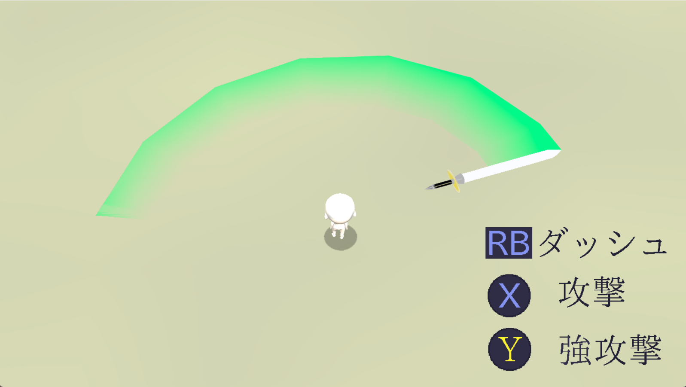
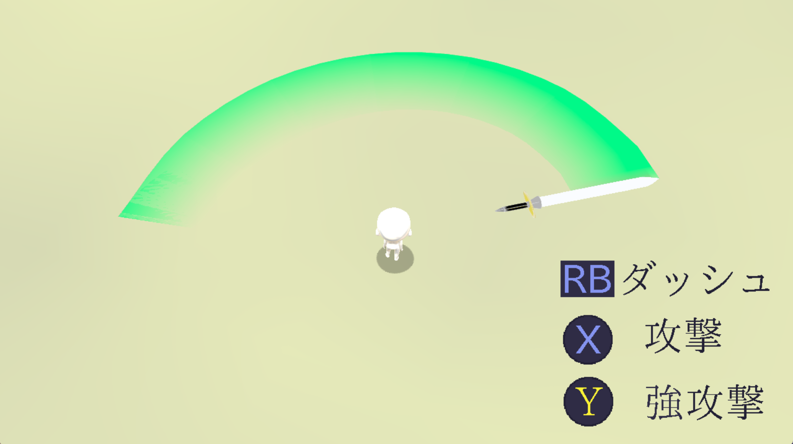
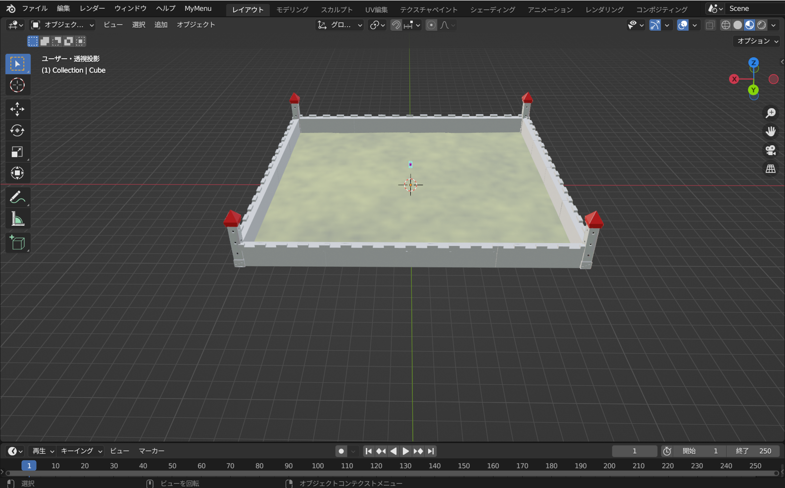
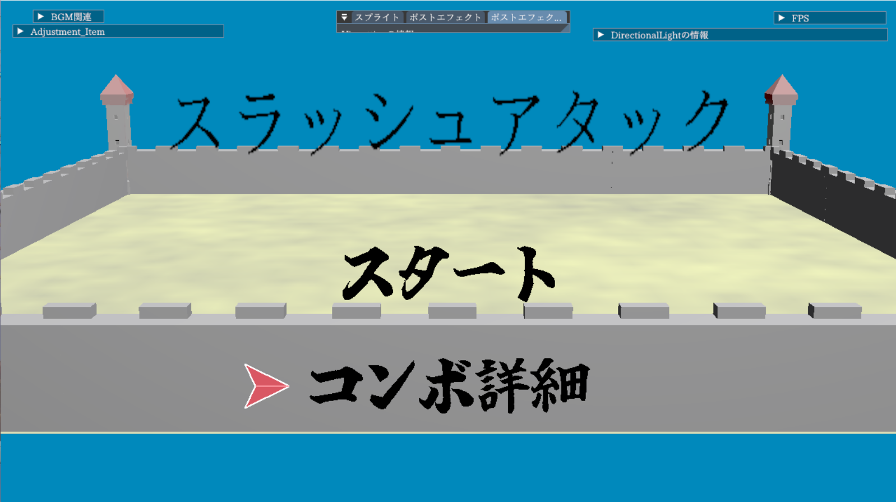
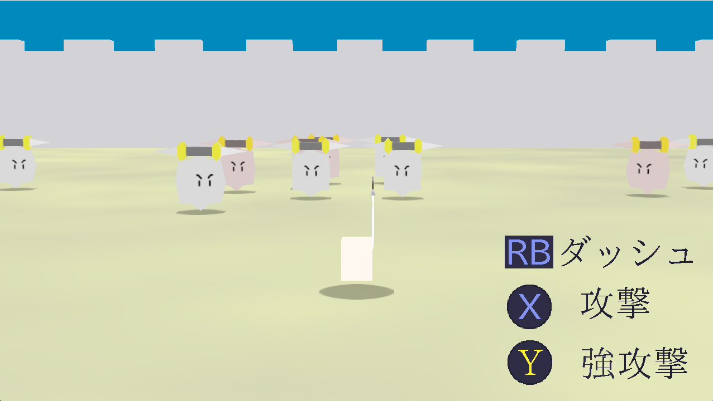

# エンジン
## 概要
### 環境はDirectX12、言語はC++で制作をしています。  
### 制作人数は一人です。  
 - **外部機能として**  
デバック用に**imgui**、画像読み込みに**DirectXTex**、Jsonファイルの読み書きに**nlohmannJson**、3Dモデルの読み込みに**assimp**を利用しています。
    -  MAEngine/externalsのフォルダにまとめられています。  

 - ファイル説明(MAEngine/)  
    - [Engine](https://github.com/aoaomidri/virtualProject/tree/master/MAProject/Engine)
       - ウィンドウ表示やテクスチャ、モデル描画などのコア部分をまとめています。
    - [externals](https://github.com/aoaomidri/virtualProject/tree/master/MAProject/externals) 
      - 上記の外部機能のファイルをまとめています。
    - [Game](https://github.com/aoaomidri/virtualProject/tree/master/MAProject/Game) 
      - SceneやPlayerなどのゲームの制作に必要なファイルをまとめています。
    - [resource](https://github.com/aoaomidri/virtualProject/tree/master/MAProject/resources)
      - 3Dモデルやテクスチャ、音源などをまとめているファイルです。

## こだわっている部分
### ・トレイル
 - 剣を振った感というものを演出するためにトレイルを利用しています。このトレイルをプログラムでは頂点情報を更新するクラスと描画させるクラスに分けて制作しています。 

   - [TrailEffecr](https://github.com/aoaomidri/virtualProject/blob/master/MAProject/Engine/3D/Object3D/Effect/TrailEffect.cpp) 頂点情報を更新するクラス
   - [TrailRender](https://github.com/aoaomidri/virtualProject/blob/master/MAProject/Engine/3D/Object3D/Effect/TrailRender.cpp) トレイルを描画するクラス    
 - トレイルを滑らかに描画するために取得した頂点情報を基に、TrailEffecr内でcatmull-Romを用いて分割を施しています。

                      分割なし                                              分割あり

### ・レベルローダー
 - Blenderにて制作、配置したシーンのJsonファイルを読み込むクラスです。 

   - [LevelLoader](https://github.com/aoaomidri/virtualProject/tree/master/MAProject/Game/LevelLoader)  
   - [StageObject](https://github.com/aoaomidri/virtualProject/blob/master/MAProject/Game/Stage/StageObject/StageObject.cpp) 実際にレベルローダーを利用している箇所  
 - 読み込んだデータは指定されたタグで取り出すことができ、モデルだけではなく設定していればtransformの情報やobbの情報なども個別に取得することができます。  

 
 

# 現在制作しているゲーム
## 概要
 - タイトル：「スラッシュアタック」
 - ジャンル：3D近接アクション
 - 制作期間：9カ月  
 - 制作人数：1人
 - 開発環境：DirectX12

### 説明
このゲームは[「fate/Samurai Remnant」](https://www.youtube.com/watch?v=7eQDcanHsT8)を参考に、1人のキャラクターを操作し複数の敵を倒していく無双型アクションゲームです。  
無双型の操作なので弱攻撃と強攻撃があり、弱攻撃の合間に強攻撃ボタンを入力することで強攻撃に派生することができます。  
現状は弱攻撃、強攻撃ともに六段ほど攻撃があります。

## こだわろうとしている部分
- 状況に応じて弱攻撃と強攻撃を使い分けて戦う**プレイヤーの操作**  
  - ボタン連打で出せる弱攻撃と派生で出せる強攻撃でメリハリをつけて制作しており、攻撃途中にも回避を出せるようにしたり動作を原作に近づけられるようにしています。

- 剣を振った後に残る**軌跡**  
  - 攻撃モーションを行った後に攻撃したことがわかりやすいようにトレイルを付けています。

## 今後の実装予定
 - 攻撃のステータスやモーションが調整できるようなエディターの制作  
 - 特殊な状況時のカメラワークの制作(カウンター、アーマーブレイクなど)  
 - 敵の出現、退場の時の演出を加える

